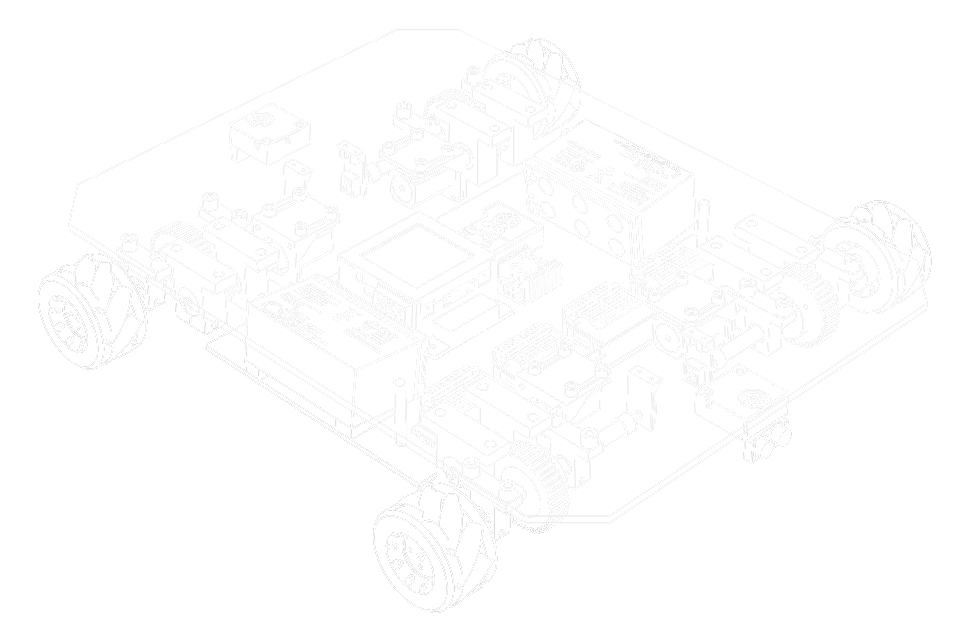
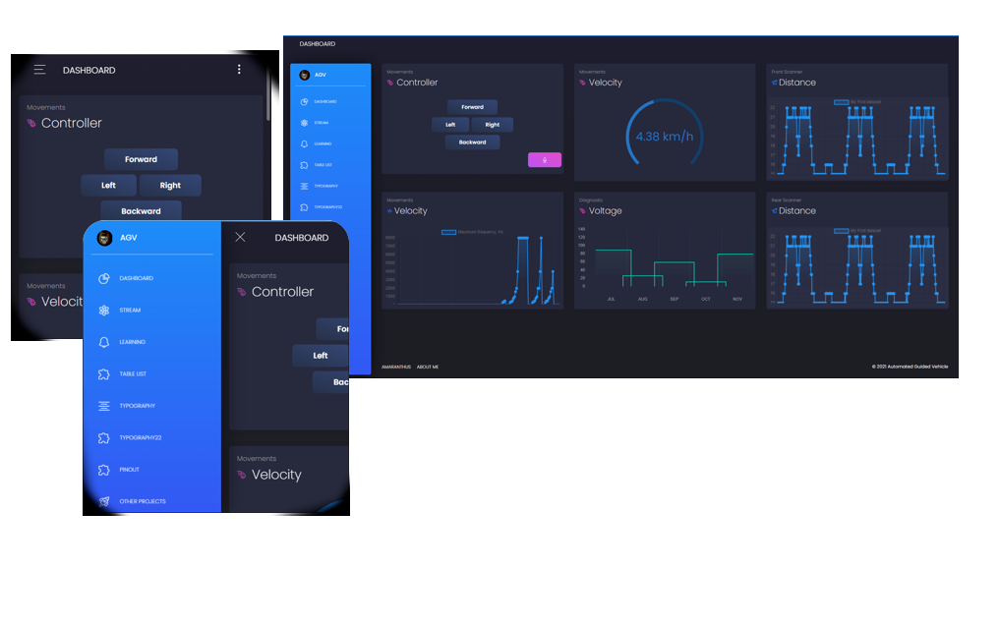
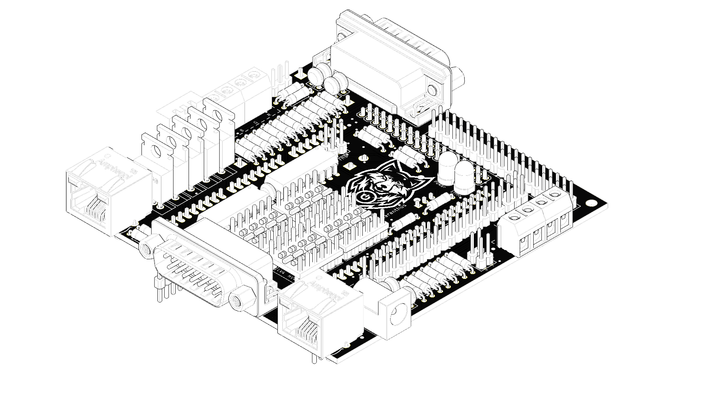

# [Robot Firmware & Full-Stack Web Application]

## AutomatedGuidedVehicle [2020-2021]

This repository contains custom robot system code.

## The AGV project has been split for two subprojects:
### Design and implementation of an AGV vehicle for non-commercial applications based on safety systems and machine learning algorithms
The motivation for developing the AGV was to automate some of the tasks of life
everyday by creating a proprietary transport and logistics system and system
integrated with other Smart devices in the apartment.

### Design, implementation and optimization control system for selected trajectories of movement and electric energy consumption diagnostics system of AGV robot
Publication describes the design of an autonomous vehicle which is part of smart home. The
description of the solution has been divided at the implementation part which includes the design
and implementation of the platform based on the decisions made resulting from the literature
review. In the research part the methods of controlling the vehicle for absolute and relative
movements are being compared. The safety systems of the robot's performance were taken into
account in accordance with the adopted standard. A system for saving and reuse of previous routes
taken by the robot was also prepared and optimized. Additionally mathematical model has been
created of the battery discharge of the tested vehicle.

 

## Main technologies:

**Debian** [Main computer system] - Linux distribution composed of free and open-source software

**Firmata** [Microprocessor firmware] - Firmata is a generic protocol for communicating with microcontrollers from software on a host computer.

**NodeJS** [Interpreter] - Cross-platform JavaScript runtime environment

**JohnnyFive** [Microprocessor controller] - JavaScript Robotics & IoT Platform.

**Express** [Webapp server] - Minimal and flexible Node.js web application framework that provides a robust set of features for web and mobile applications.

**SocketIO** [Real-time communication] - Bidirectional and low-latency communication for every platform.

**ReactJS** [Front-end UI library] - A JavaScript library for building user interfaces.

| Human-Machine Interface - ReactJS      | Robot computer - PCB                                 |
| ----------------------------- | --------------------------------------------- |
|        |  |
